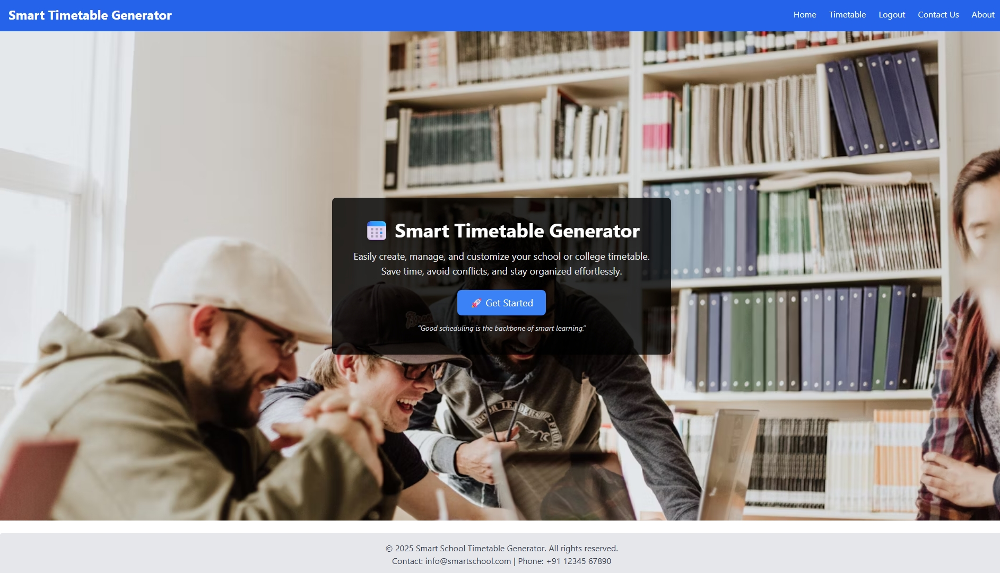
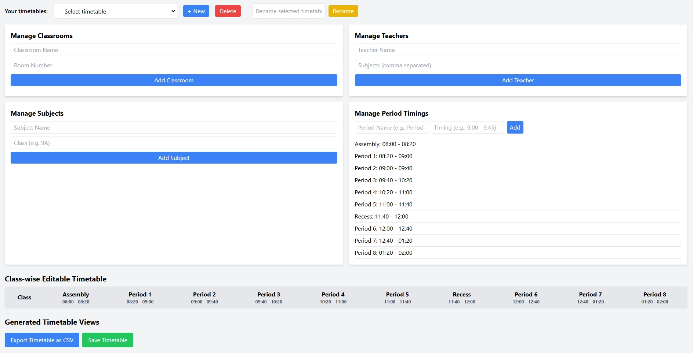

# Smart Timetable Generator
<!-- ALL-CONTRIBUTORS-BADGE:START - Do not remove or modify this section -->
[](#contributors-)
<!-- ALL-CONTRIBUTORS-BADGE:END -->

A web-based timetable management system that allows schools/colleges to easily create, manage, and view timetables for teachers, classes, subjects, and rooms.

## 🚀 Features
- 🔐 User Authentication (Register/Login)
- 📅 Create & Save Timetables
- 👨‍🏫 Teacher-wise, Day-wise, Subject-wise, and Room-wise Views
- ⚠️ Conflict Detection (detects teacher/room clashes)
- 💾 Auto-save & Load Last Saved Timetable
- 🖨️ Print-friendly Layout (for PDF export)
- 🌐 Built with **React, Node.js, Express, MongoDB**

## 🛠️ Tech Stack
**Frontend:** React, TailwindCSS, Axios  
**Backend:** Node.js, Express  
**Database:** MongoDB (Mongoose)  

## 📂 Project Structure
smart-timetable/
│── backend/ # Node.js + Express server
│── frontend/ # React application
│── README.md
│── CONTRIBUTING.md
│── CODE_OF_CONDUCT.md
│── LICENSE

## ⚙️ Installation & Setup

### 1. Clone the repository
```bash
git clone https://github.com/<your-username>/smart-timetable.git
cd smart-timetable
```

2. Setup Backend
```bash
cd backend
npm install
npm run dev
```

3. Setup Frontend
```bash
Open another terminal:
cd frontend
npm install
npm run dev
```

Frontend will run at http://localhost:5173

Backend will run at http://localhost:5000

💡 Usage

Register/Login as a user.

Create a timetable by assigning teachers, subjects, and rooms.

Save timetable → Data is stored in MongoDB.

Reload → Last saved timetable is auto-loaded.

Switch to Teacher/Day/Subject/Room views for quick access.


## 📸 Screenshots

### Homepage


### Timetable View



## 🤝 Contributing

We welcome contributions! Please see our [Contributing Guide](CONTRIBUTING.md).

## 👥 Contributors
Thanks to these wonderful people who have contributed to this project:
<!-- ALL-CONTRIBUTORS-LIST:START - Do not remove or modify this section -->
<!-- prettier-ignore-start -->
<!-- markdownlint-disable -->
<!-- markdownlint-restore -->
<!-- prettier-ignore-end -->
<!-- ALL-CONTRIBUTORS-LIST:END -->

This project follows the [all-contributors](https://github.com/all-contributors/all-contributors.github.io) specification. Contributions of any kind are welcome!

### How to Add Yourself as a Contributor

After your PR is merged, comment on your PR:
`@all-contributors please add @your-username for code, doc, design`

### Contribution Types:
- **code** - 💻 Code
- **doc** - 📖 Documentation  
- **design** - 🎨 Design
- **ideas** - 🤔 Ideas & Planning
- **bug** - 🐛 Bug Reports
- **test** - 🧪 Tests
- **review** - 👀 Reviewed PRs
- **infra** - 🚇 Infrastructure
- **question** - 💬 Answering Questions

See `CONTRIBUTORS_GUIDE.md` for detailed instructions.

## 📜 Code of Conduct

This project follows a [Code of Conduct](CODE_OF_CONDUCT.md).

## 📄 License

This project is licensed under the [MIT License](LICENSE).
